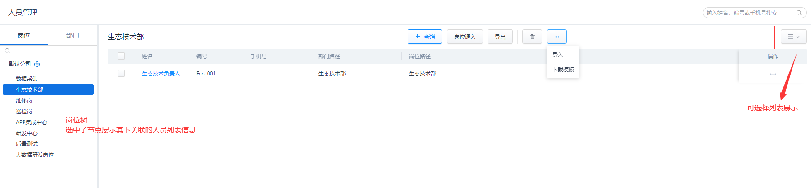
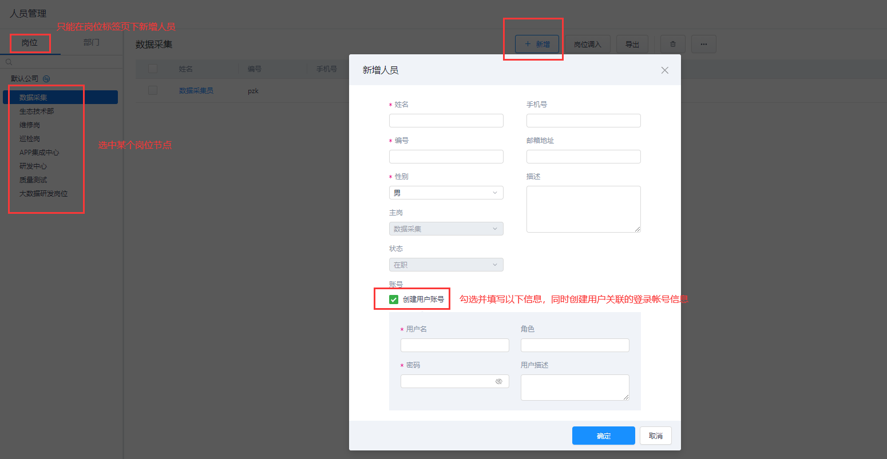
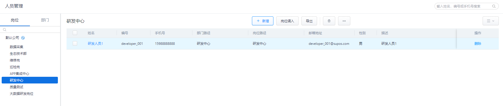
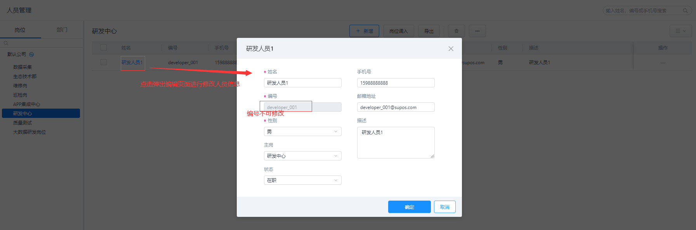
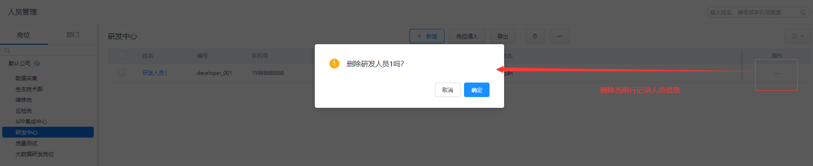
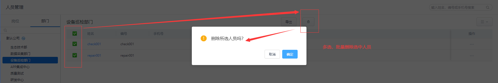
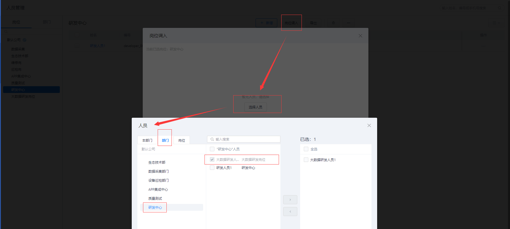
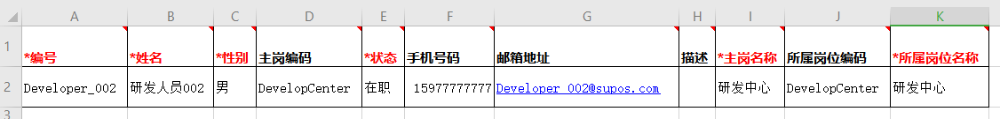
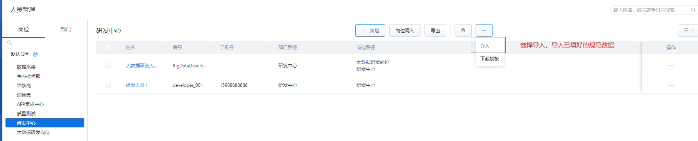
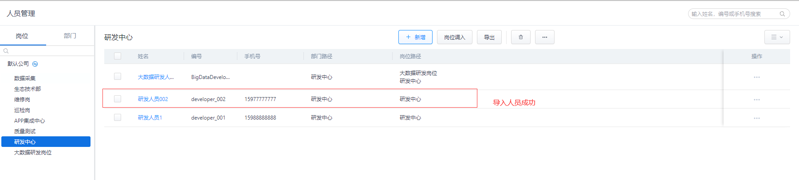

> ## **人员管理**

---

**人员管理页面中分为：岗位、部门两个标签页面。**

---

> ### **新增人员**

---

**只有在「**岗位**」标签页中，可以新增人员，人员必须关联到某个岗位上，通过「**人员--岗位--部门**」的层级结构，确认人员与部门之间的关联关系。**

---

「注意」 
一个人员可关联多个岗位； 
一个人员只能一个主岗； 
一个人员只能属于一个部门； 

---

- **选择某个岗位子节点，点击页面上方的「**新增**」按钮，在选中的岗位下新增人员记录；**
- **输入新增人员详情信息；**
  - 「**姓名**」：新增人员姓名；
  - 「**编码**」：用于人员信息唯一标识，一经确认**不可**根据人员信息自行修改；
  - 「**性别**」：下拉选择项；
  - 「**主岗**」：默认选中当前选中的岗位信息；
  - 「**状态**」：默认选中在职状态；
  - 「**手机号**」：非必填；
  - 「**邮箱地址**」：非必填；
  - 「**描述**」：对人员进行描述信息编辑；
- **输入关联登录帐号信息；**
  - 「**创建用户帐号**」：选中该复选框后，将同时创建当前人员关联的登录帐号信息；
  - 「**用户名**」：用于登录帐号信息唯一标识，一经确认**不可**根据人员信息自行修改；
  - 「**密码**」：登录密码，初始登录后需要进行修改；
  - 「**角色**」：非必填，选择用户角色信息；
  - 「**用户描述**」：非必填，对人员登录帐号进行描述信息编辑；
  
- **点击「确定」按钮，新增人员完成；**

---

> ### **人员列表**

---

**岗位新增人员后，将显示当前岗位下关联的所有人员列表。**

---

> ### **编辑人员**

---

**点击人员名称，弹出人员信息编辑页面，其中：人员编号 不可修改，人员名称、关联岗位、状态等信息可再次编辑。**

---

> ### **删除人员**

---

- **点击人员信息行记录右侧的      按钮可以当前行记录人员信息。**

- **批量选择行记录左侧的复选框，点击页面上方的      按钮可以批量删除人员信息。**

---

> ### **岗位调入**

---

**点击页面上方的「岗位调入」按钮，可以将不同部门下/岗位下的人员调入移动到当前岗位下，从而实现人员调换的目的。**

---

> ### **导入人员**

---

- **点击页面上方的「**下载模板**」，下载人员导入模板；**

---

---

- **根据格式填写模板信息；**

---

|字段名称|是否必填|说明|
|:---|:---|:---|
|编号|是|长度不可以超过200|
|姓名|是|长度不可以超过200|
|性别|是|只能为"男"或"女"|
|状态|是|只能为"在职"或"离职"|
|主岗名称|是|当主岗名称存在重复的情况，需要提示用户填写主岗编码|
|主岗编码|否|当主岗编码和主岗名称同时填写，以编码为主|
|手机号|否|支持填写数字，长度不限|
|邮箱地址|否|验证邮箱格式|
|所属主岗名称|是|标识该人所在的岗位； 可以只填写所属岗位名称； 当有重复时提醒用户填写所属岗位编码； 如果二个都填写，以岗位编码为准。|
|所属主岗名称|否|同上|
|描述|否|描述长度不可以超过500|

---

- **点击页面上方的「**导入**」，导入人员数据模板；**

---

