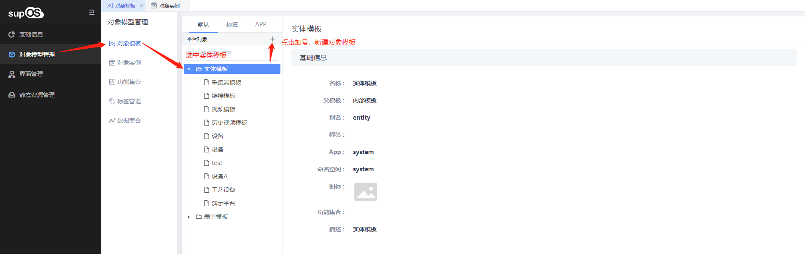
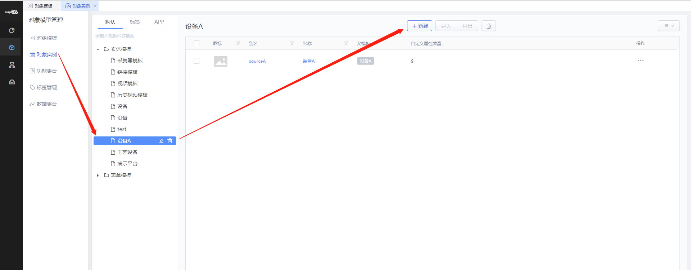
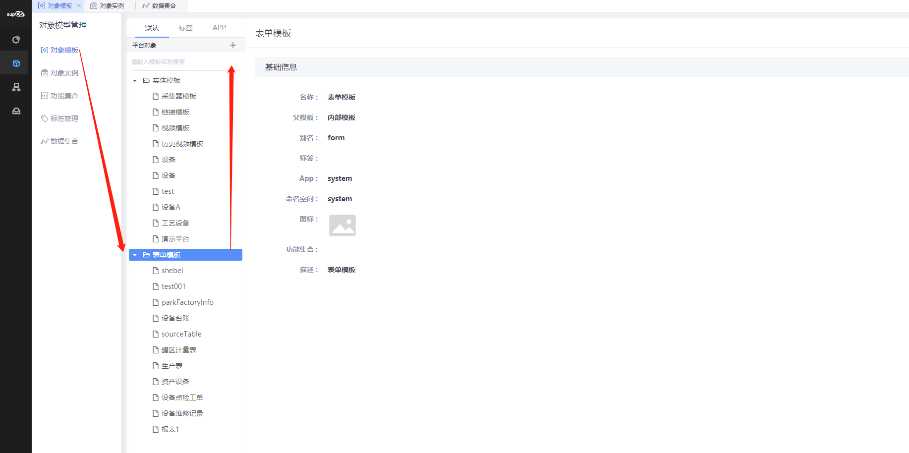

> ## **「生产计量」对象建模**

---

**根据需求分析与表结构分析，需要对等的创建以下模板对象：**

- 实体模板：「设备A」
- 对象实例：「sourceA」
- 表单模板：「生产表」「罐区计量表」

*关于对象模型管理x详细设计请参考[《supOS工厂建模管理软件用户手册V2.4.pdf》](http://oss.supos.com/docs/ProductManual/supOS/V2.8.1/supOS工厂建模管理软件用户手册V2.4.pdf)*

---

- [实体模板-设备A](/docs/ProductionMana/ObjectData/deviceA)
- [对象实例-sourceA](/docs/ProductionMana/ObjectData/sourceA)
- [表单模板-生产表](/docs/ProductionMana/ObjectData/productionTable)