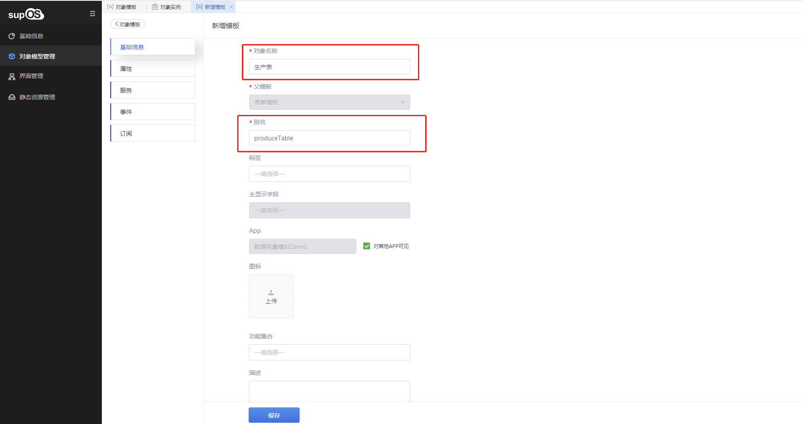
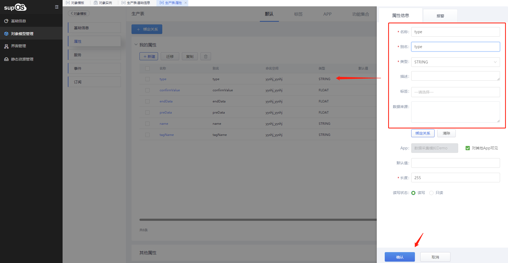

> ## **表单模板「生产表」**

---

> ### **创建「生产表」表单模板**

---

- 在「对象模型管理--对象模板」菜单下，选择一个「表单模板」作为父模板，点击，在该模板下创建一个新的表单模板，自动继承父模板；
- 输入对象模板基础信息；
- 点击「保存」按钮，即创建模板完成；

---

「注意」 
在信息创建成功后，将会展示当前实体模板所在的「**命名空间**」，该信息将用户对象的整个生命周期，用于与其他对象的数据隔离与请求标识；

---

---

> ### **编辑「生产表」基础信息**

---

选中创建成功的「生产表」表单模板，点击右下角的「详情」按钮进入子页面，选择「基础信息」标签页，进行信息编辑；

---

> ### **「生产表」设置属性字段**

---

选中创建成功的「生产表」表单模板，点击实例名称，进入详情设置页面；

- 点击左侧的「属性」标签，展开「我的属性」，点击「+ 新建」，新增属性信息。
  - 「注意」名称为表字段的中文表述，别名为表字段的键值，与表字段一一对应；

