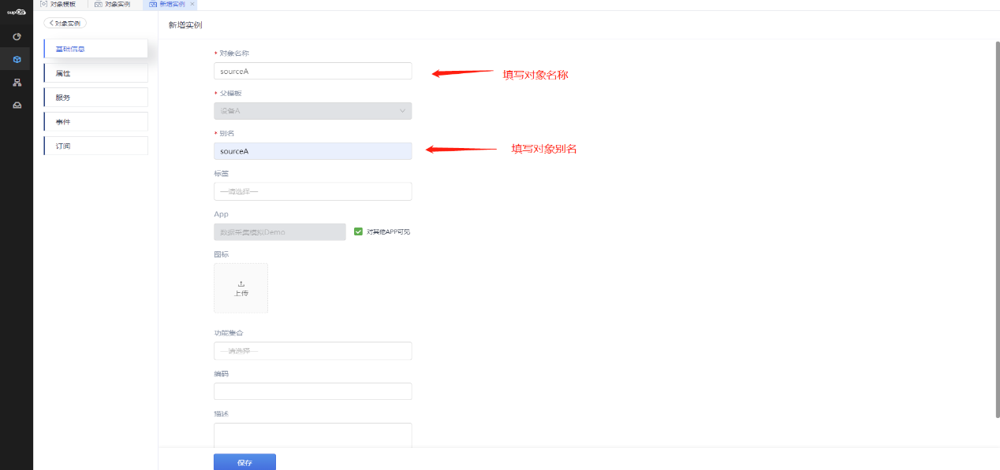
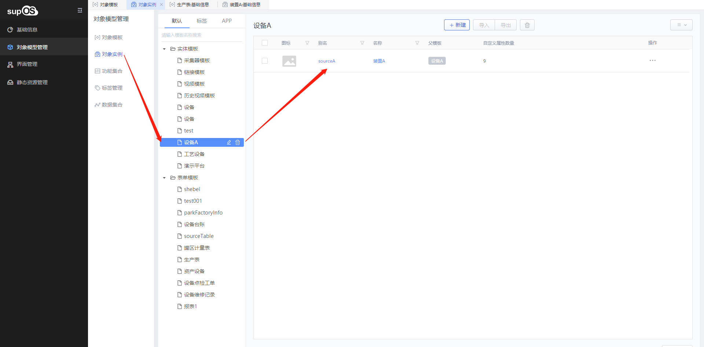
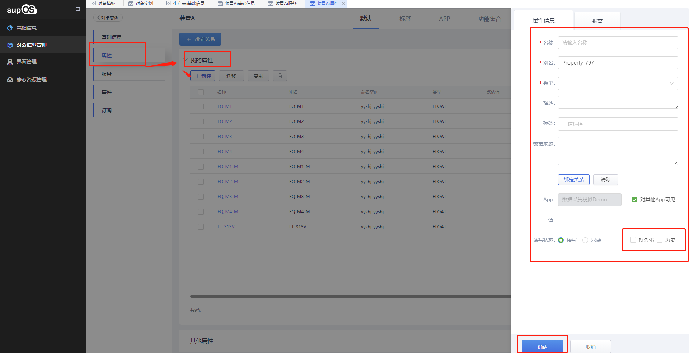
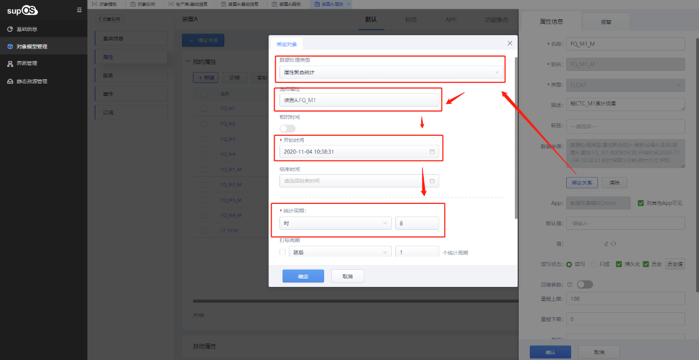
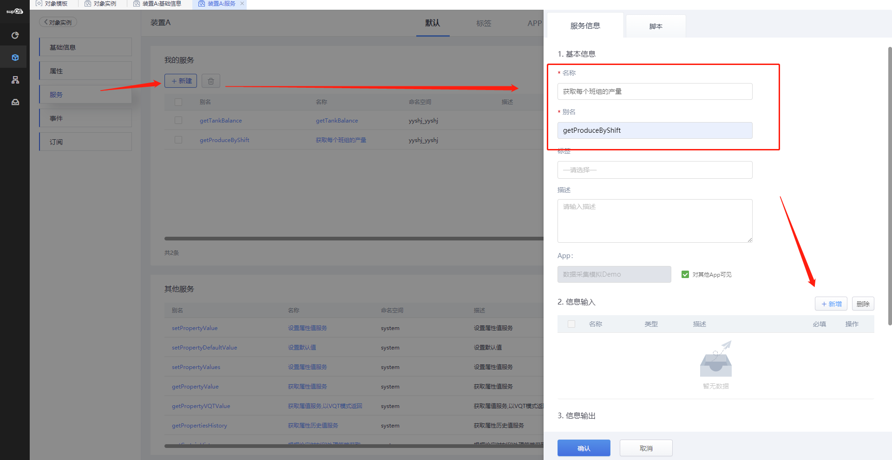
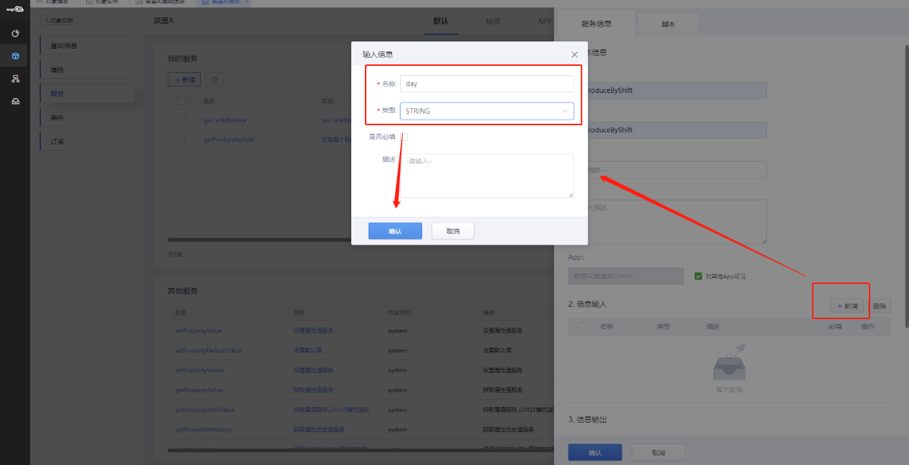

> ## **对象实例「sourceA」**

---

> ### **创建「sourceA」对象实例**

---

- **在「对象模型管理--对象实例」菜单下，选择一个「实体模板」作为父模板，点击创建的「设备A」，在该模板下创建一个新的实例对象，自动继承父模板结构信息；**
- **输入对象实例基础信息；**
  - 「**对象名称**」：必填，对象实例名称，用户可自定义修改
  - 「**父模板**」：在创建实例时选择的模板作为该实例的父母版，在此处**不可手动修改**；
  - 「**别名**」：必填，用于对象实例唯一标识，别名自动生成，可根据对象实例信息自行修改定义其含义，**在工厂中一般可与位号一致**。例如“DJ_01”；
  - 「**标签**」：从对象类别的标签中给对象实例添加多个标签，用于标记对象实例方便归类查询，也可在编辑对象实例时添加标签；
  - 「**APP**」：用于对象模板的分类，如果通过某个APP创建的对象模板，该对象模板会关联相应的工业APP标签。在平台端新建对象模板，该对象模板默认为system；在APP设计器内新建对象实例，该对象实例默认属于该APP；勾选是否对其它APP可见；
  - 「**图标**」：上传图片作为对象实例的图标；
  - 「**功能集合**」：调用系统已增加的功能集合，继承该功能集合的所有属性、服务、事件、订阅等功能；
  - 「**编码**」：输入该对象的编码，一般与工程现场设备编码一致；
  - 「**描述**」：用于记录对象的版本更新时修改信息的详细记录，也可用于对象实例的详情描述；

- **点击「保存」按钮，即创建模板完成；**

---

---

> ### **设置「sourceA」对象属性信息**

---

**选中创建成功的「sourceA」对象实例，点击实例名称，进入详情设置页面；**

**点击左侧的「属性」标签，展开「我的属性」，点击「+ 新建」，新增属性信息：属性名称，属性别名，选择属性值类型，勾选持久化和历史，保证属性数据长期储存。**

---

> ### **为属性配置数据来源**

---

**选中某个属性值，点开属性信息，点击「绑定关系」绑定数据源。**

本案例通过属性「**数据聚合**」模拟真实的数据采集过程，选择「**开始时间**」和「**统计周期**」，统计方式选择「**求和**」，表示该属性，会将被选择的属性过去8小时的值求和并保存；

---

> ### **配置服务「getProduceByShift」**

---

- **点击左侧的「服务」标签，展开「我的服务」，点击「+ 新建」，新增自定义服务；**
- **输入服务基础信息；**
  - 「**名称**」：必填，用户可自定义修改；
  - 「**别名**」：必填，系统默认生成，用户可自定义修改，在调用服务时使用该名称调用；
  - 「**标签**」：从标签中给对象服务添加多个标签，用于标记服务方便归类查询；
  - 「**描述**」：服务内容的详情描述；
  - 「**信息输入**」：定义脚本的输入参数;
    - 点击右侧「+ 新增」输入参数，可根据业务场景定义多个输入参数，设置输入参数的**数据类型**、**是否为必填项**以及**描述**信息；
  - 「**信息输出**」：输出值的名称默认为result，不可更改;
    - 设置脚本输出值的**数据类型**以及**描述**信息，根据设置的类型输入对应的结果，例如类型为JSON时需要设置返回格式等；
- **输入服务脚本信息；**
  - 脚本编辑器。提供基本类型的服务函数，通过服务器端脚本（目前支持JavaScript语言）完成用户定义服务的具体实现，方便脚本方便快速的创建；
  - 「**对象选择器**」：脚本中可调用系统的对象属性数据进行脚本编程；
  - 「**调试**」：执行脚本测试。点击「**调试**」按钮，弹出执行测试对话框，模拟输入参数后点击「**执行测试**」，显示执行结果，即脚本运行正常；

---

|**图标**|||||||||
|:---:|:---:|:---:|:---:|:---:|:---:|:---:|:---:|:---:|
|**说明**|**撤销**|**恢复**|**左缩进**|**右缩进**|**注释**|**取消注释**|**缩放编辑器**|**搜索**|

---

**自定义服务脚本详见：**

- [getProduceByShift](/docs/DeviceInfo/ObjectService/getProduceByShift)
- [getTankBalance](/docs/DeviceInfo/ObjectService/getTankBalance)

---

