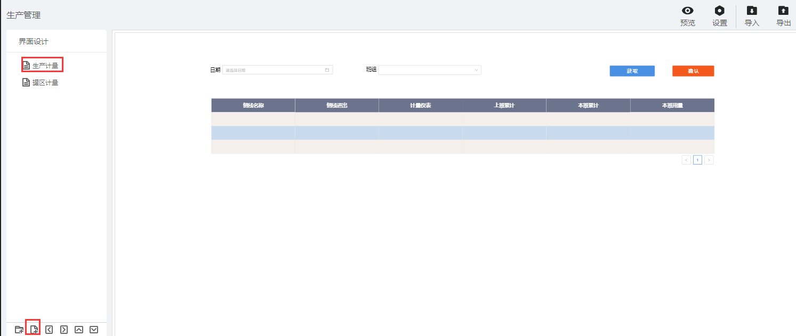
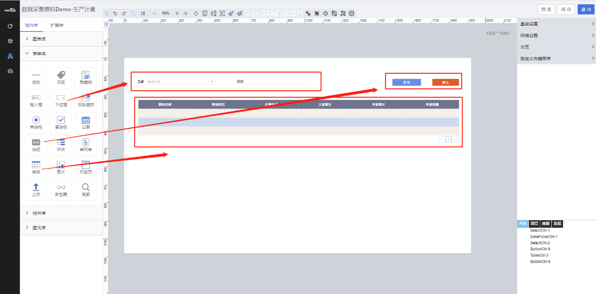
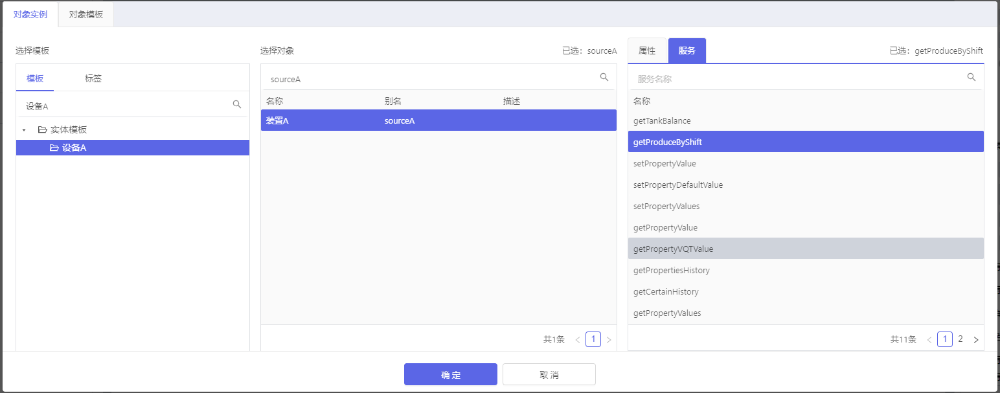
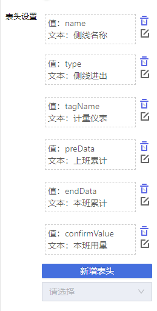
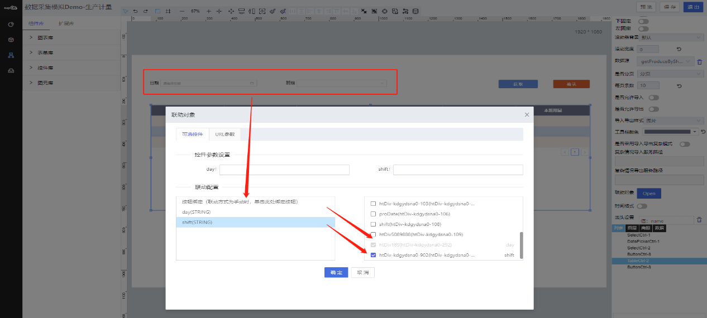

> ## **「生产计量」页面**

---

- **根据基础操作介绍，新增「生产计量」页面；**
- **双击页面空白处，或者点击页面右上角的编辑按钮，进入画布设计器；**

---

> ### **页面功能分析**

---

- 需要如下主要功能：
  - 「**数据获取**」
    - 根据日期、班组联动查询列表信息；
  - 列表「**数据初始化**」
    - 页面刚进来时需要加载已有的数据；
    - 分页进行展示；
  - 「**行记录渲染**」
    - 当前行可编辑，单击「**本班用量**」行数据记录，变化为可编辑状态，可修改当前字段值；
  - 「**保存确认**」；

---

> ### **所需控件及关键操作说明**

---

- **主要用到表单库中的：按钮、下拉框、日期控件、表格；**
- **根据UI设计，将对应的控件拖拽到画布上，可打开网格视角调整对齐格式等样式；**
- **设置控件名称；**
  - 为每一个控件设置控件别名，方便通过别名获取其属性值；
- **为「班组」下拉框，配置静态数据源；**
- **「日期」控件显示指定格式数据；**
  - 设置控件属性，选择对应的日期格式数据类型；
- **「表格控件」**
  - **绑定数据源**：选择已设置好的 「**对象实例--sourceA--服务--getProduceByShift(获取每个班组的产量)**」；
  - **设置分页**
  - **设置联动**
    - 点击联动对象「OPEN」进行联动设置，查询数据；
  - **设置表头**
    - 「注意」设置表头的值需要与数据集合的字段保持一致。
  - **行记录编辑渲染**

---

*组态大致流可参考：[设备资产APP--页面组态--列表页面](/docs/DeviceInfo/PageDesign/pageList)*

> ### 脚本服务示例

---

**选中相应的控件，点击右侧的「交互」属性，为相应的控件绑定「单击」「数据加载」等事件，将对应的脚本服务代码写入，执行服务。**

- **常用服务参考**
  - [常用脚本服务](/docs/DeviceInfo/ObjectService/commonJS)
  - [内置对象服务](https://supos-project.github.io/supOS-Object-Documents/#/docs/ObjectService/Service/)
- **当前页面使用脚本**
  - [行渲染编辑事件](/docs/ProductionMana/ObjectService/rowProduction)
  - [行编辑数据保存](/docs/ProductionMana/ObjectService/submitProduction)