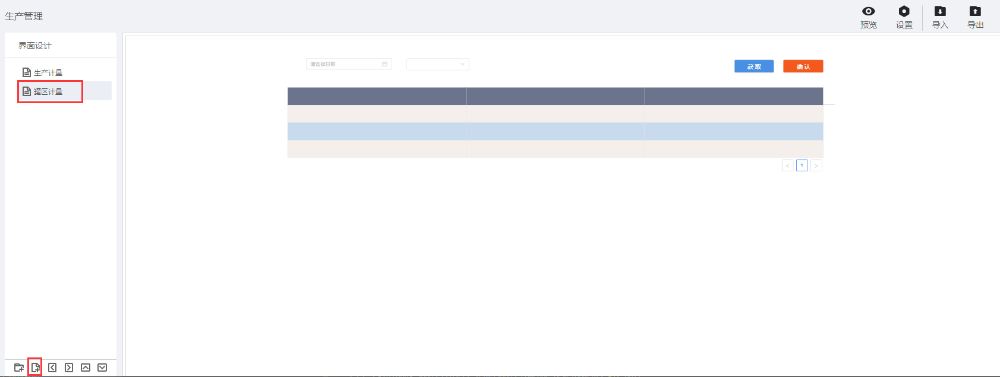

> ## **「罐区计量」页面**

---

- **根据基础操作介绍，新增「罐区计量」页面；**
- **双击页面空白处，或者点击页面右上角的编辑按钮，进入画布设计器；**

---

> ### **页面功能分析**

---

- 需要如下主要功能：
  - 「**数据获取**」
    - 根据日期、班组联动查询列表信息；
  - 列表「**数据初始化**」
    - 页面刚进来时需要加载已有的数据；
    - 分页进行展示；
  - 「**行记录渲染**」
    - 当前行可编辑，单击「**实际值**」行数据记录，变化为可编辑状态，可修改当前字段值；
  - 「**保存确认**」；

---

> ### **所需控件及关键操作说明**

---

*组态大致流可参考：[生产管理APP--页面组态--生产计量](/docs/ProductionMana/PageDesign/productionMetering)*

---

> ### 脚本服务示例

---

**选中相应的控件，点击右侧的「交互」属性，为相应的控件绑定「单击」「数据加载」等事件，将对应的脚本服务代码写入，执行服务。**

- **常用服务参考**
  - [常用脚本服务](/docs/DeviceInfo/ObjectService/commonJS)
  - [内置对象服务](https://supos-project.github.io/supOS-Object-Documents/#/docs/ObjectService/Service/)
- **当前页面使用脚本**
  - [行渲染编辑事件](/docs/ProductionMana/ObjectService/rowTankFarm)
  - [行编辑数据保存](/docs/ProductionMana/ObjectService/submitTankFarm)