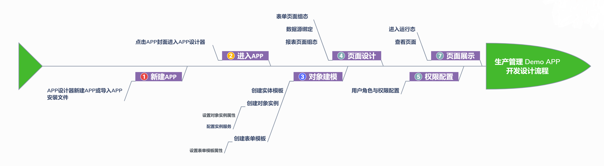

> ## **APP设计思路**

---

> ### **设计流程**

---

---

> ### **需求分析**

---

- **列表页面**需要如下主要功能：
  - 联动服务「**条件查询**」；
  - 「**数据获取**」；
  - 「**保存确认**」；
  - 列表「**数据初始化**」：分页展示；
  - 「**行记录渲染**」：当前行可编辑；

---

> ### **表设计**

---

- 当前案例中，对象实例「**sourceA**」设定主要包含以下属性字段：

|名称|字段名|字段类型|持久化/历史|描述|
|:---|:---|:---|:---|:---|
|FQ_M3_M|FQ_M3_M|FLOAT|持久化/历史|CTC外售1_M3累计流量|
|FQ_M1_M|FQ_M1_M|FLOAT|持久化/历史|粗CTC_M1累计流量|
|FQ_M2_M|FQ_M2_M|FLOAT|持久化/历史|粗CTC_M2累计流量|
|FQ_M4_M|FQ_M4_M|FLOAT|持久化/历史|CTC外售2_M4累计流量|
|FQ_M1|FQ_M1|FLOAT|持久化/历史|粗CTC_M1累计流量|
|FQ_M4|FQ_M4|FLOAT|持久化/历史|CTC外售2_M4累计流量|
|FQ_M2|FQ_M2|FLOAT|持久化/历史|粗CTC_M2累计流量|
|FQ_M3|FQ_M3|FLOAT|持久化/历史|CTC外售1_M3累计流量|
|LT_313V|LT_313V|FLOA|T持久化/历史||

- 当前案例中，表单模板「**生产表**」设定主要包含以下属性字段：

|名称|别名|类型|描述|
|:---|:---|:---|:---|
|preData|preData|FLOAT|上班累计|
|confirmValue|confirmValue|FLOAT||
|name|name|STRING||
|endData|endData|FLOAT|本班累计|
|type|type|STRING|侧线进出|
|tagName|tagName|STRING|计量仪表|

- 当前案例中，表单模板「**罐区计量表**」设定主要包含以下属性字段：

|名称|别名|类型|描述|
|:---|:---|:---|:---|
|out|out|FLOAT|本班累计|
|actual|actual|FLOAT|实际值|
|preTank|preTank|FLOAT|期初罐存|
|name|name|STRING|储罐名称|
|intoi|nto|FLOAT|上班累计|
|tagName|tagName|STRING|液位计|
|balance|balance|FLOAT|平衡率%|
|theory|theory|FLOAT|理论值(交班罐存)|

---

> ### **基础操作参考**

---

- 参考：[**新建APP**](/docs/BasicOperation/createNewApp)
- 参考：[**APP设计器**](/docs/BasicOperation/DesignerMenu/)
- 参考：[**对象建模**](/docs/Summary/conceptIntro)
- 参考：[**界面设计**](/docs/BasicOperation/PageDesign/)