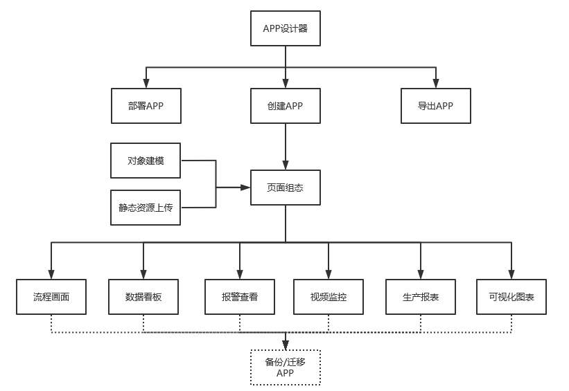

> ## **快速入门**

---

> ### **环境准备**

---

在进行APPs开发之前，首先需要一个supOS实例，开发者可以在云上开通ESS实例进行开发，也可以在私有化部署的supOS实例中进行开发。当ESS实例的版本和supOS实例的版本相同时，其对应的APP格式也是相同的。

> #### **开通ESS云服务实例**

---

ESS云服务，英文全称为Elastic supOS Service，即弹性supOS服务。通过开通ESS实例进行开发，能够有效地帮助开发者降低硬件资源成本、加快开发速度，也方便集成商、代理商等快速开发或集成各种应用服务，以最低的成本尽可能实现高收益，推荐大部分开发者选择。

开发者可以登录蓝卓云门户订阅并开通ESS云服务；对于通过合作伙伴计划进行签约的合作伙伴(ISV)，则可能可以免费开通蓝卓专为开发用途提供的开发云(DevCloud) ESS实例，具体请与生态BD团队联系。

[注册蓝卓云帐号](https://developer.supos.com/docs/register-account)

[认证为企业客户](https://developer.supos.com/docs/certify-customer)

[开通ESS云服务实例](https://developer.supos.com/docs/ess-purchase)

> #### **私有化部署supOS**

---

通过线下签订supOS采购合同，安装部署supOS操作系统平台。

*关于安装部署说明请参考[《supOS工业操作系统软件安装手册V2.4.pdf》](http://oss.supos.com/docs/ProductManual/supOS/V2.8.1/supOS工业操作系统软件安装手册V2.4.pdf)*

---

> ### **工业APP操作流程图**

---

工业APP设计器是一个开放式、自由化、多功能的组态软件，工业APP由一个或多个组态页面组成，可展示不同类型的监控画面，可以在此实现工业企业管理需要的所有页面，下图为工业APP的操作流程图。

---

> ### **对象建模操作流程图**

---

*关于对象模型管理请参考[《supOS工厂建模管理软件用户手册V2.4.pdf》](http://oss.supos.com/docs/ProductManual/supOS/V2.8.1/supOS工厂建模管理软件用户手册V2.4.pdf)*

对象脚本服务说明详见：[内置服务详情](https://supos-project.github.io/supOS-Object-Documents/#/docs/ObjectService/)

---

> ### **页面组态操作流程**

---

- 设置画布属性，例如背景、标题、边框等；
- 控件库中选择你想要的控件，在画布上按住鼠标进行拖拽或单击，画出控件；
- 配置控件属性，在属性栏进行配置；
- 重复2-3步骤，在画布上添加多个控件，排列在画布上；
- 保存页面，进行预览查看显示结果。

*关于页面组态开发请参考[《supOS工业APP组态开发软件用户手册V2.4.pdf》](http://oss.supos.com/docs/ProductManual/supOS/V2.8.1/supOS工业APP组态开发软件用户手册V2.4.pdf)*

supOS控件使用说明详见：[supOS控件说明](https://supos-project.github.io/supOS-Object-Documents/#/docs/CommonIntro/)