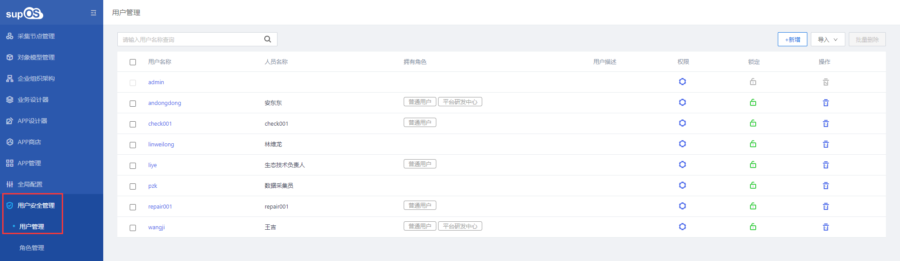
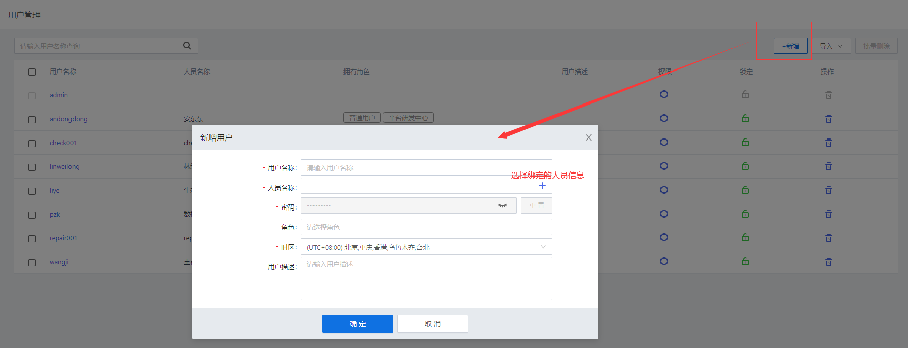
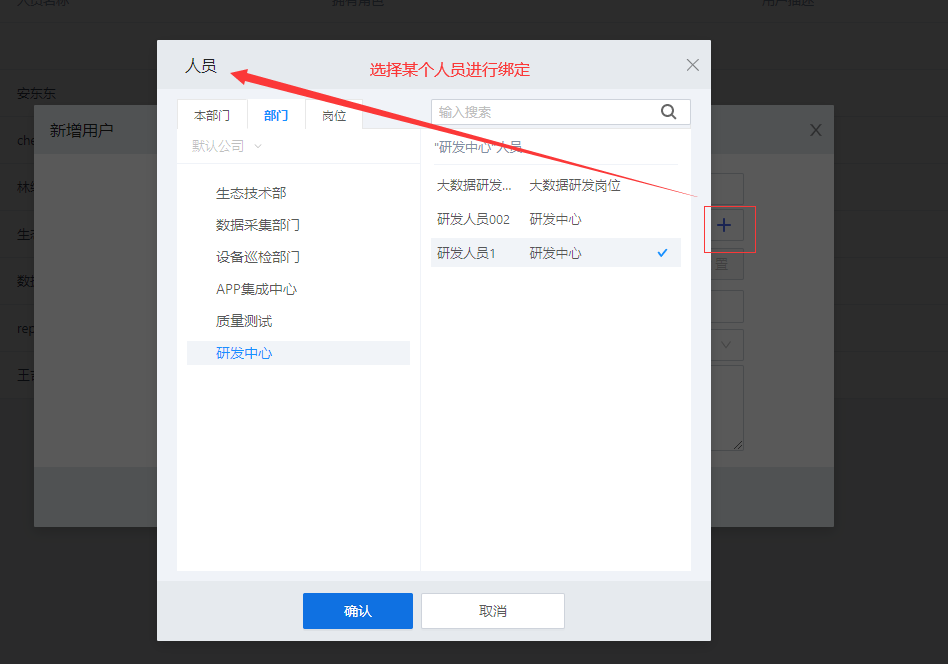
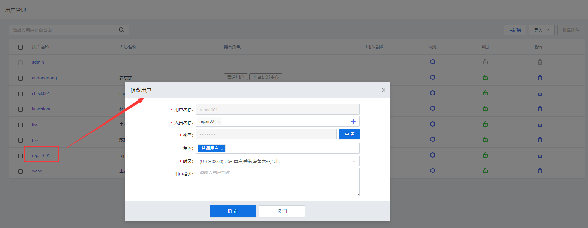
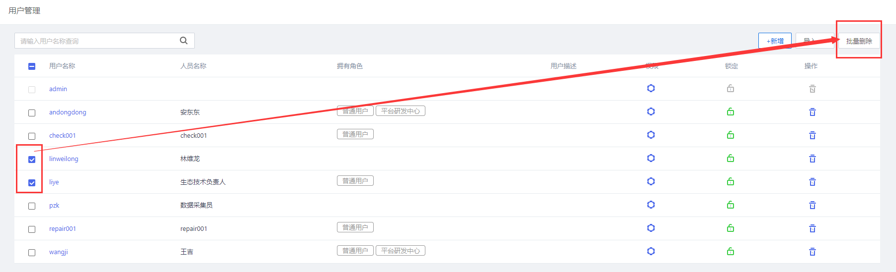
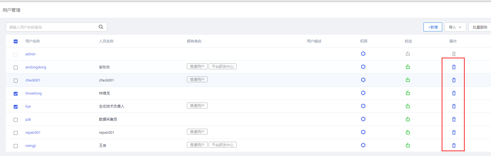
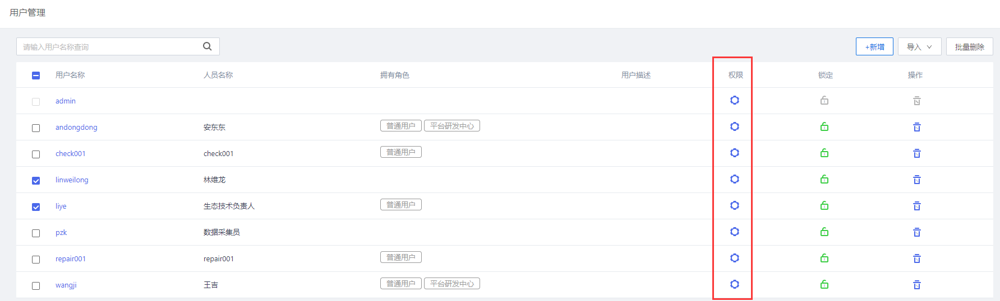
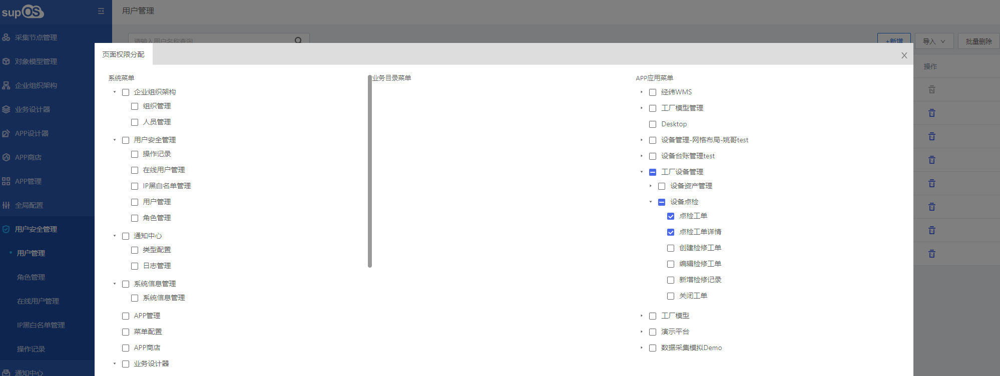
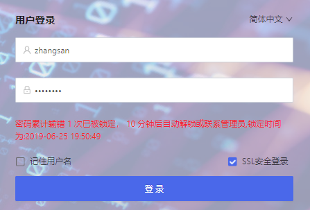
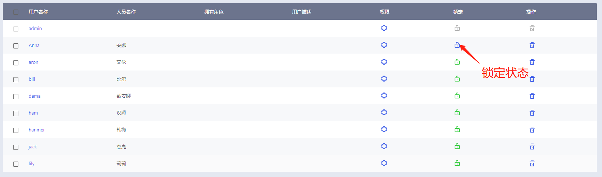

> ## **用户管理**

---

点击菜单「**用户安全管理 --- 用户管理**」，查看用户列表信息，

---

「注意」 人员与用户关联关系 
用户必须关联人员，新增用户前，必须绑定关联绑定某个人员信息； 

---

---

> ### **新增用户**

---

**新增部门组织结构，部门结构下关联岗位与人员，部门负责人为部门关联人员的直属领导。**

- **点击用户管理信息界面右上角的「+ 新增」按钮；**
- **在弹出「新增用户」窗口中输入用户信息；**
  - 「**用户名称**」：必填，登录用户名；
  - 「**人员名称**」：必填，选择某个人员进行绑定；
  - 「**密码**」：必填，默认生成登录密码，用户**首次登录提示更改密码**；
    - 管理员点击    按钮可以查看默认生成的密码，用户登录系统修改后管理员无权查看。
  - 「**角色**」：选择用户对应的角色，例如管理员、普通用户，一个用户可选择多个角色，用户自动继承角色的所有权限且不可更改；
  - 「**时区**」：必填，选择用户所在时区，默认为（UTC+08:00）北京，重庆，香港，乌鲁木齐，台北；
  - 「**用户描述**」：编辑用户描述信息；
  

  

- **点击「确定」按钮，新增用户完成；**

---

> ### **编辑用户**

---

**在用户管理显示信息页面，点击想要编辑的用户名称，弹出修改用户信息页面，灰色文本框为不可编辑项，白色文本框为可编辑项。**

**可重新绑定关联人员、重置密码、修改角色、时区及对用户描述进行编辑，编辑完成后点击「确定」按钮即可修改成功。**

---

> ### **删除用户**

---

「注意」 
管理员手动删除用户时，不能删除当前登录用户以及admin用户。 

---

- **在显示信息页面，点击用户信息行左侧的复选框（下图红色区域），信息页面右上角「批量删除」按钮图标点亮，点击「批量删除」将选择的用户进行批量删除。**

- **在显示信息页面，点击用户信息行右侧的删除图标按钮（下图红色区域），在弹出的“提示”对话框中点击「确定」，用户删除完成。删除后不可恢复，请谨慎操作。**

---

> ### **配置权限**

---

**用户继承了所关联的角色的所有权限，用户的权限可通过设置用户权限来单独配置。**

- **在显示信息页面，点击用户信息行右侧的权限图标按钮（下图红色区域），弹出权限配置窗口；**

- **设置“页面权限分配”，对该用户系统显示的菜单项进行设置，用户继承角色的权限默认勾选且无法编辑。**
  - 「**系统菜单**」：用户可查看的系统菜单界面；
  - 「**业务目录菜单**」：用户可查看的业务设计器内的界面；
  - 「**APP应用菜单**」：用户可查看的APP应用界面；

---

> ### **锁定用户**

---

**若密码规则设置「密码重试次数」，在输入错误密码超过设置次数时用户被锁定；**

**登录管理员账户，进入当前菜单界面，点击解锁按钮图标解除用户锁定。**

---

「注意」 
管理员手动锁定用户时，不能锁定当前登录用户以及admin用户。 

---