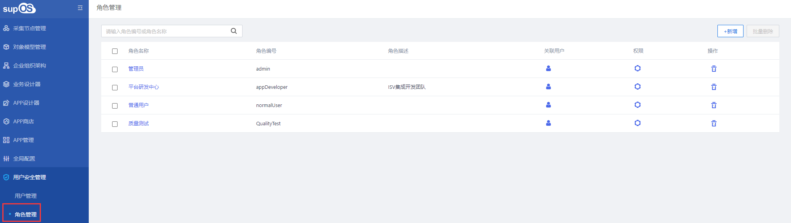
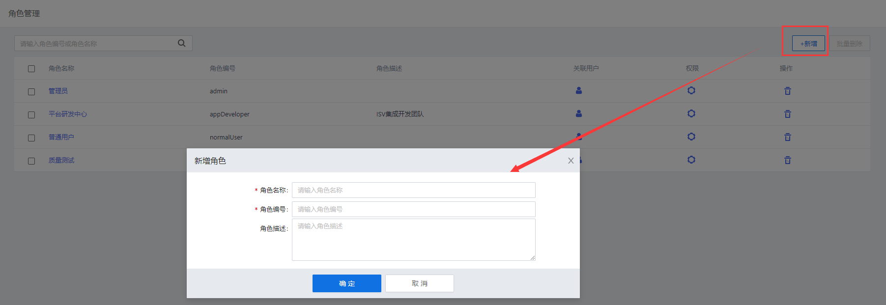
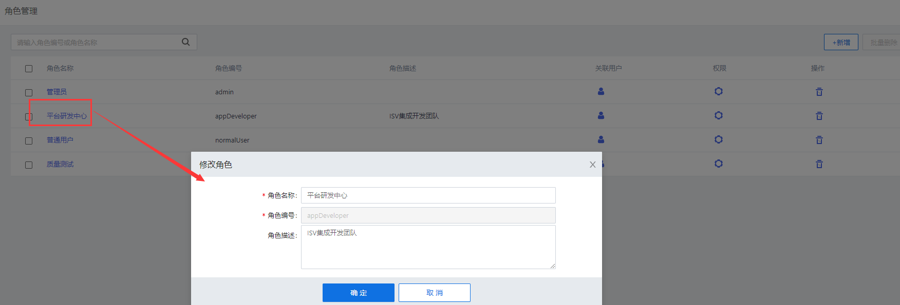
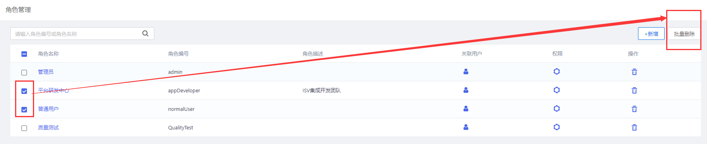
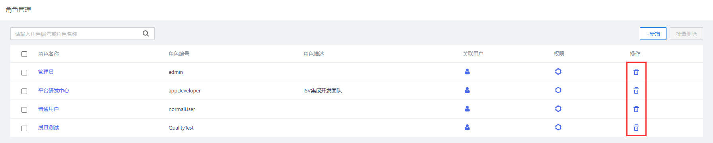
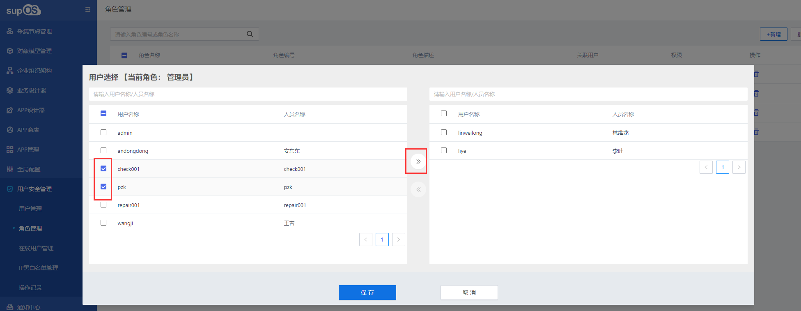

> ## **角色管理**

---

点击菜单「**用户安全管理 --- 角色管理**」，查看角色列表信息，

**对用户角色进行定义，根据不同的角色分配相应权限；**

---

> ### **新增角色**

---

- **点击角色管理信息界面右上角的「+ 新增」按钮；**
- **在弹出「新增角色」窗口中输入角色信息；**
  - 「**角色名称**」：必填，输入中文、字母、数字的组合名称；
  - 「**角色编号**」：必填，输入以字母开头，字母数字和_的组合编号；
  - 「**角色描述**」：编辑角色描述信息；
  

- **点击「确定」按钮，新增用户完成；**

---

> ### **编辑角色**

---

**在角色管理显示信息页面，点击想要编辑的角色名称，弹出修改角色信息页面，灰色文本框为不可编辑项，白色文本框为可编辑项。**

---

> ### **删除角色**

---

「注意」 
已绑定用户的角色，需要先解除绑定用户再删除角色。 

---

- **在显示信息页面，点击角色信息行左侧的复选框（下图红色区域），信息页面右上角「批量删除」按钮图标点亮，点击「批量删除」将选择的角色进行批量删除。**

- **在显示信息页面，点击角色信息行右侧的删除图标按钮（下图红色区域），在弹出的对话框中点击「确定」，角色删除完成。删除后不可恢复，请谨慎操作。**

---

> ### **关联用户**

---

**根据角色，批量选择用户与该角色进行关联，也可批量取消用户关联。**

- **在角色管理信息界面，选择某个角色点击「关联用户」按钮；**

- **在弹出的用户选择器中，在左侧批量选择所要关联的用户后，点击将用户放到右侧；**
  - 「**提示**」：用户选择器中左侧为待选用户，右侧为已关联用户，也可将右侧的用户迁移到左侧取消关联。

- **点击「保存」按钮，角色与用户关联完成；**

---

> ### **配置权限**

---

- **大致配置流程，请参照：[用户管理--配置权限](/docs/UserRole/accountMana?id=配置权限)**